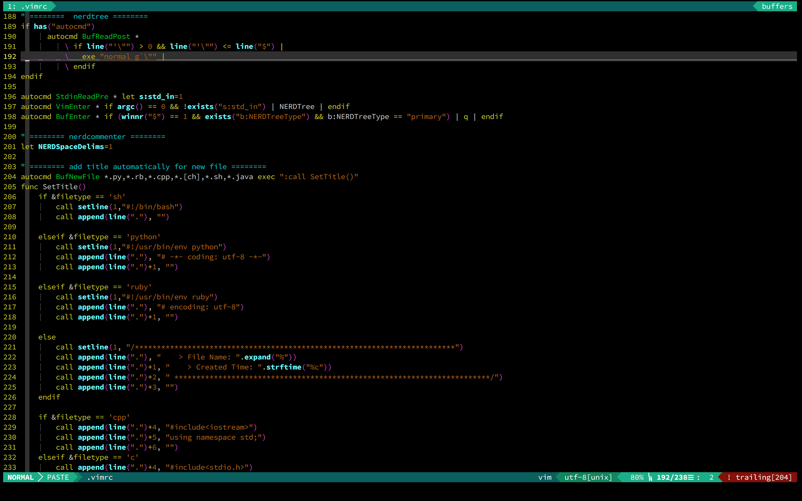

# vim配置与安装

### screenshot

vim配置其实思路很简单，无非是一个`.vimrc`文件外加各种插件。不过从一个新手开始的话还是挺折腾的。

我的配置只配置一些简单的插件，并对`.vimrc`进行了一些丰富，简洁实用即可。

有兴趣的可以直接运行下面的命令使用我的vim配置，如果想在里面加入各种插件也很方便。了解vundle怎么管理插件就行了

### 快速安装

在终端中运行下面的命令即可一键安装(完成后还需小小的设置一下)：

`
wget -qO- https://raw.github.com/xuliuchengxlc/vim/master/install.sh | sh -x
`

### 注意事项

- airline插件需要字体支持，记得安装完成后在terminal的字体设置中将原有字体改为带有`for powerline`样式的字体。
- 运行`sh ~/.vim/conf/uninstall.sh`即可卸载该配置
