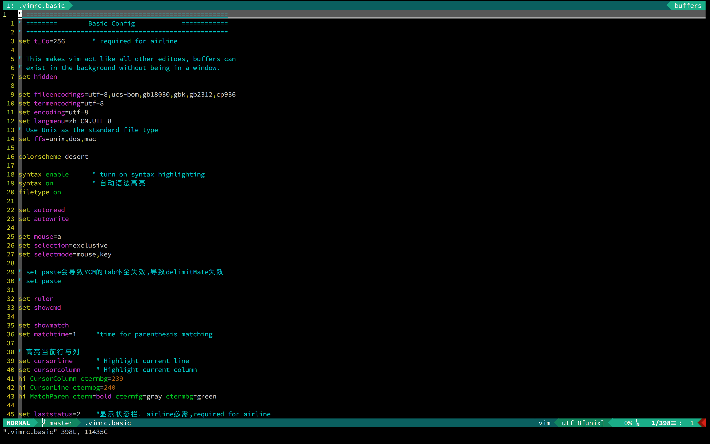

# vim安装配置与简要介绍

## 安装配置

vim配置其实思路很简单，无非是一个`.vimrc`文件外加各种插件。不过从一个新手开始的话还是挺折腾的。

我的配置只配置一些简单的插件，并对`.vimrc`进行了一些丰富，简洁实用即可。`.vimrc`为结构文件，包含了`.vimrc.basic`和`.vimrc.vundle`内容。`.vimrc.basic`为一些无插件的实用设置，`.vimrc.vundle`为各种插件及其设置。

有兴趣的可以直接运行下面的命令使用我的vim配置，如果想在里面加入各种插件也很方便。了解vundle怎么管理插件就行了

vim的前缀键映射模仿了spacemacs的方式。

### 快速安装

在终端中运行下面的命令即可一键安装(安装完成后， 关于字体还需小小的设置一下)：

#### curl
`
sh -c "$(curl -fsSL https://raw.github.com/xuliuchengxlc/vim/master/install.sh)"
`
#### wget
`
sh -c "$(wget https://raw.github.com/xuliuchengxlc/vim/master/install.sh -O -)"
`

### 注意事项

- airline插件需要字体支持，记得安装完成后在terminal的字体设置中将原有字体改为带有`for powerline`样式的字体。
如在CentOS的terminal设置中，：

- 运行`sh ~/.vim/conf/uninstall.sh`即可卸载该配置.
- Ubuntu刚刚安装好后terminal可能会显示有些异常，只需关闭再打开即可恢复正常。

## 配置简要介绍

除了一些增强可用性的设置，在快捷键的映射上继承了[spacemacs](https://github.com/syl20bnr/spacemacs)的思想。

### 前缀键

设置前缀键为空格键, 您设置重新设置为喜欢的键

`let mapleader="\<Space>"`

###  简单操作
-  quit, 退出  
`nmap <leader>q  :q<cr>`
- 不保存直接退出  
`nmap <leader>Q  :qa!<cr>`
- down, 向下移动半屏  
`nmap <leader>d  <C-d>`
- up, 向上移动半屏  
`nmap <leader>u  <C-u>`

### 文件操作
file, ` <leader>f + *`
- file save, 保存文件  
`nmap <leader>fs :w<cr>`
- file dotfile basic, 打开基本配置文件.vimrc.basic  
`map <silent> <leader>fdb :e ~/.vimrc.basic<cr>`
- file dotfile vundle, 打开插件配置文件.vimrc.vundle  
`map <silent> <leader>fdv :e ~/.vimrc.vundle<cr>`

###  窗口操作
window,  `<leader>w + *`
- <leader>ww, 在所有窗口中循环移动  
`map <leader>ww <C-W>w`
- <leader>wr, window replace, 向右或向下方交换窗口  
`map <leader>wr <C-W>r`

 分屏窗口移动, Smart way to move between windows  
- `map <C-j> <C-W>j`
- `map <C-k> <C-W>k`
- `map <C-h> <C-W>h`
- `map <C-l> <C-W>l`

###  缓冲区操作
buffer,` <leader>b + *`
- 切换前后buffer  
`nnoremap <leader>bp :bprevious<cr>`  
`nnoremap <leader>bn :bnext<cr>`    
" bd : buffer delete  
" bw : like bd, but really delete the buffer.  
" Everything related to the buffer is lost.  
" All marks in this buffer become invalid, option settings are lost, etc.  
" Don't use this unless you know what you are doing.  
`nnoremap <leader>bd :bd<cr>`
`nnoremap <leader>bw :bw<cr>`

- 根据buffer的数字编号进行切换  
`nnoremap <leader>b1 :b1<cr>`  
`nnoremap <leader>b2 :b2<cr>`  
`nnoremap <leader>b3 :b3<cr>`  
`nnoremap <leader>b4 :b4<cr>`  
`nnoremap <leader>b5 :b5<cr>`  
`nnoremap <leader>b6 :b6<cr>`  
`nnoremap <leader>b7 :b7<cr>`  
`nnoremap <leader>b8 :b8<cr>`  
`nnoremap <leader>b9 :b9<cr>`  

###  标签页操作
tab,     ` <leader>t + * `
- tab切换
`nnoremap <leader>tf :tabfirst<cr>`  
`nnoremap <leader>tl :tablast<cr>`  

`nnoremap <leader>tj :tabnext<cr>`  
`nnoremap <leader>tk :tabprev<cr>`  
`nnoremap <leader>tn :tabnext<cr>`  
`nnoremap <leader>tp :tabprev<cr>`  

`nnoremap <leader>te :tabedit<cr>`  
`nnoremap <leader>td :tabclose<cr>`  
`nnoremap <leader>tm :tabm<cr>`  

-  normal模式下切换到确切的tab
`nnoremap <leader>t1 1gt`  
`nnoremap <leader>t2 2gt`  
`nnoremap <leader>t3 3gt`  
`nnoremap <leader>t4 4gt`  
`nnoremap <leader>t5 5gt`  
`nnoremap <leader>t6 6gt`  
`nnoremap <leader>t7 7gt`  
`nnoremap <leader>t8 8gt`  
`nnoremap <leader>t9 9gt`  
`nnoremap <leader>tl :tablast<cr>`  

